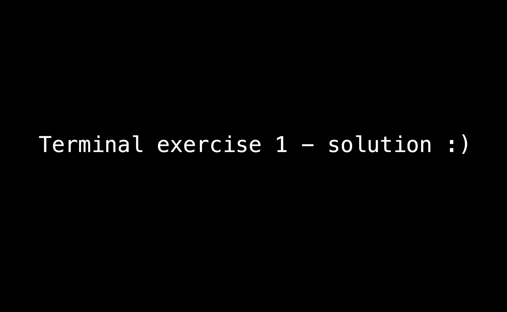

# Terminal Exercises :)

## EXERCISE 1: Getting, Manipulating, & Directing Text Data
_**Goal:**_ extract all the errors in the log filter and sort all unique errors.
| Step   | Task |
|-|-|
| 1 | Navigate to desktop |
| 2 | Create a new folder called 'terminal_practice' |
| 3 | Go into your new folder |
| 4 | [Download](https://raw.githubusercontent.com/briggstwitchell/terminal_workshop/main/exercises/file_with_errors.txt) the `file_with_errors.txt` file from Github and it in your new folder. |
| 5 | Peak at the contents of the file you just downloaded |
| 6 | Create a new text file called 'unique_errors.txt' that we'll send all the unique errors to |
| 7 | Find the errors in the file and send all unique errors to a new textfile, sorting them in ascending order |
| 8 | Check that your new file contains only unique errors in sorted order |

[**VIDEO SOLUTION:** Terminal Exercise 1 -- Getting, Manipulating, & Directing Text Data](https://youtu.be/bKKZ5syMMDY) 

_Try out the commands on the [file_with_errors_large.txt](./file_with_errors_large.txt) and see if it works_

***

## EXERCISE 2:  Executing Shell Scripts from Any Directory
_**Goal:**_ Modify the shell script to work on Python files. Then, make it executable from any directory on your computer.
| Step   | Task |
|-|-|
| 1 | Navigate to desktop |
| 2 | [Download](https://raw.githubusercontent.com/briggstwitchell/terminal_workshop/main/exercises/make_header.sh) the `make_header.sh` file from Github. |
| 3 | Edit the `make_header.sh` file with Vim & TMUX to make it compatible with Python (it already works with Java & C) |
| 4 | Find your `PATH` directories for executable files |
| 5 | Move your edited .sh file to `PATH` (need to invoke super user access for this) |
| 6 | Modify the permissions on the make_header.sh file in your PATH to be _executable_ (need to invoke super user access for this)|
| 7 | Create or modify your `.zshprofile` (`.bash_profile` if you're using bash) file to include a new     environment variable called 'FILEWITHHEADER', that points to your `make_header.sh` executable.|

You should be able to just call this variable with `$(FILEWITHHEADER)` and have it execute the script, saving you the time to write headers when you create files!

[**VIDEO SOLUTION:** Terminal Exercise 2 -- Executing Shell Scripts from Any Directory](https://youtu.be/qB74sIWwN5k)

 
***

